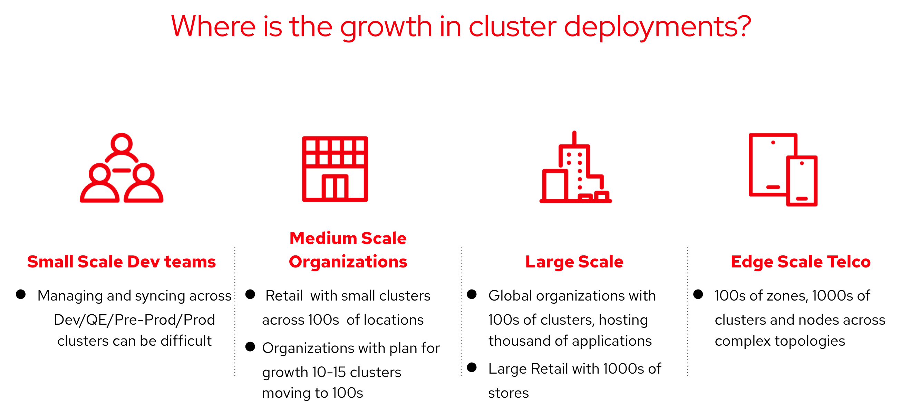
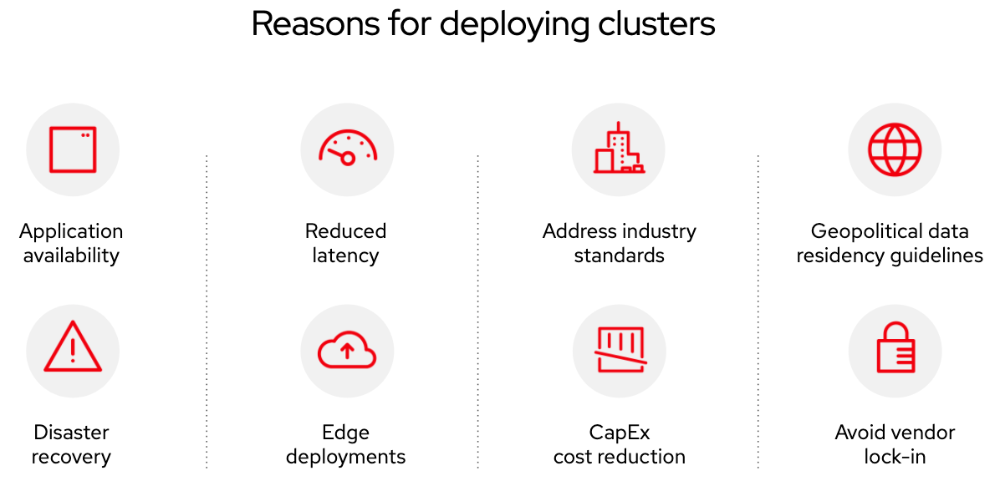
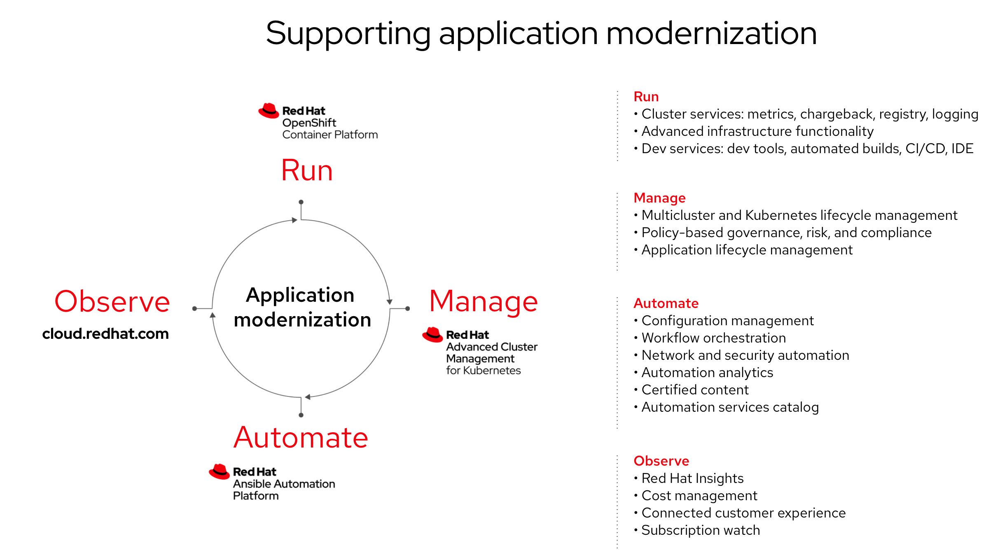
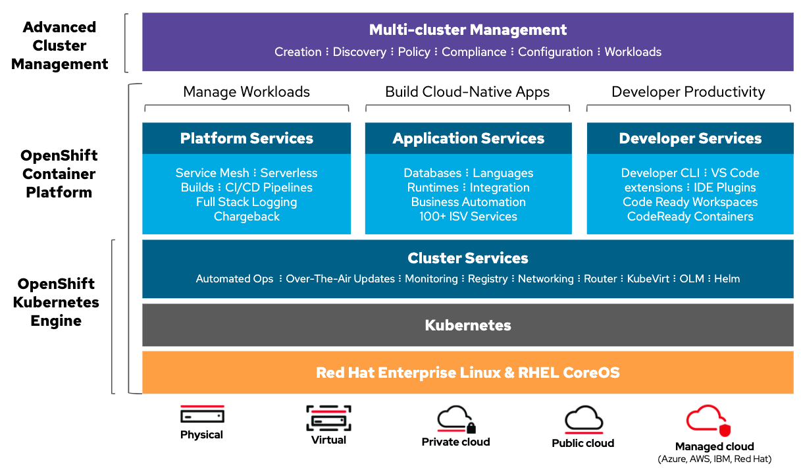

# Overview 

## Multi-Cluster Management

### 멀티 클러스터 사용은 어디서 활발히 사용되는가? 



```
Dev/Qe/Red-prod/prod 클러스터에서 동기화를 관리하는 것은 어려울 수 있습니다. 


100개 이상의 위치에 작은 클러스터가 있는 소매점입니다. 

성장 계획이 있는 조직 10-15 Cluter가 100으로 이동합니다. 


수천 개의 애플리케이션을 호스팅하는 100개의 클러스터가 있는 글로벌 조직. 

1000개의 매장이 있는 대형 소매점 


복잡한 토폴로지에서 100개 영역, 1000개 클러스터 및 노드.
```


### 왜 클러스터를 배포하는가?



​       
|                |      |
| --------------------------------------- | ---- |
| application avaiabiltity                | 애플리케이션 가용성 |
| Reduced latency                         | 대기 시간 감소 |
| address industry standards              | 업계 표준 해결 |
| Geopolitical data redidency  guidelines | 지정학적 데이터 중복성 가이드라인 |
| Disaster recovery                       | 재해 복구 |
| Edge deployments                        | 에지 배포 |
| CapEx Cost reduction                    | 자본 지출 비용 절감 |
| Avoid vendor  lock-in                   | 공급업체 종속 방지 |


### application modernization 



```
Run

Manage

Automate

Observe

```





# The need for multi-cluster management


# The personas to consider


# Cluster Lifecycle


# Application Lifecycle


# Governance, Risk, Compliance
