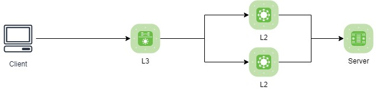
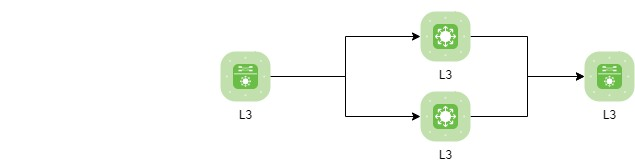
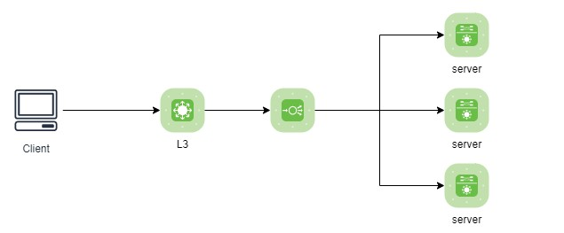
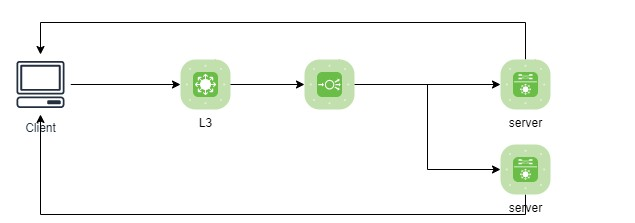

# load balance
 
## load balance란
 
- 부하 분산 : 동일한 역확을 하는 서버 여러대에 부하를 분산하여 서비스 하는 것을 가능하게 하는 방법
 
- 분산 목적 : 어플리케이션/서버/네트워크 부하를  분산하기 위해 

-----
 

>로드밸선스에 자주 사용되는 용어  
>scale out : 서버에 부하가 발생하여 처리가 힘들 경우 동일한 역활의 서버를 추가하여 지속적 서비스가 가능하도록 함   
>scale in  : scale out을 하여 여러대로 분산처리중 서버의 수량이 줄어도 서비스가 가능하여 수량을 줄이는 것
 
## load balance의 종류
OSI 7 계층을 기준으로 어떻게 부하를 분산 할지에 따라 종류가 나뉨

| layer | 설명 | 비고 |
|:---:|:---:|:---:|
| L2 | Data link 계층을 사용, Mac주소 기반 부하 분산 | teaming, bonding |
| L3 | Network 계층을 사용, IP주소 기반 부하 분산 | |
| L4 | Transport 계층을 사용, Port 기반 부하 분산 | TCP, UDP |
| L7 | Application 계층을 사용, 요청(URL) 기반 부하 분산 | HTTP, HTTPS 등 |

 
## load balance의 주요 작동 방식 

### Bridge/Transparent  (L2)
- 사용자가 LB로 요청 
- LB에서 connection을 넘겨줄 real server 확인 
- header에서 자신의 아이피인  destination IP를  real server IP로 변경 
- destination mac을  real server mac로 변경 

### Route (L3)
- Bridge/Transparent 방식과 유사하나 source Mac도 변경한다

### Nat (network address translation) (L4)
- 사용자가 LB로 요청 
- header에서 자신의 아이피인  destination IP를  real server IP로 변경 
  (real server IP는 사설망)

### tunnering (L4)

### DSR (direct server routing protocol) (L4)
- 사용자가 LB로 요청 
- destination mac을  real server mac로 변경
  (arp 관리 중요)

  
 
## load balance의 분배 방식

### Round Robin
요청 순서 별로 서버에 균등하게 분배 

### Weighted Round Robin
기본은 Round Robin 방식이지만 서버별 가중치를 지정하여 가중치에 따라 균등 분배 

### Least Connection
서버마다 연결수를 체크하여 연결 수가 적은 곳으로 연결 

###  Weighted Least Connection
기본은 Least Connection 방식이지만 서버별 가중치를 지정하여 가중치에 따라 분배 

### Fastest Response Time
서버의 응답이 빠른 곳으로 분배

### source hash scheduling
hash table에 사용자의 IP를 저장하여 그 결과에 따라 분배 
항상 같은 서버로 접속을 보장  

##성능평가
- L2, L3와 같은 국제 표준에 의해 정해진 기능이나 지표가 없다.

	- **초당 연결수(Connections per second)**
		- 하나의 TCP 연결은 클라이언트와 서버간의 쓰리-웨이 핸드쉐이크(three-way handshake) 동작(하나의 SYN과 두 개의 ACK 패킷)으로 정의
		- TCP 세션을 열고(opening) 닫는(closing) 작업은 L4 레벨의 기본 세션 관리의 가장 핵심적인 동작, L4의 포워딩 엔진 부분에 가장 많은 작업량을 요구하는 작업이므로, 이 지표는 L4의 네트워크 프로세서 디바이스나 커널의 성능에 따라 좌우
  		
	- **동시 연결수(Concurrent connections)**
		- TCP 세션을 유지 할 수 있는 수치.
		- TCP 세션이 열리면 바로 닫히는 것이 아니라 사용자는 세션을 유지함. 이를 얼마나 관리하고 유지 할 수 있느냐가 관건.
		- 많은 세션을 관리해야되므로 메모리에 의존적.
		- 시중에 수천에서 무제한까지 제공하는 state-less 로드밸런싱(해싱알고리즘) 장비도 있음. 다른 네트워크 장벽이나 서버에서 제한 될 수 있음.
  		
	- **처리용량(Throughput)**
		- 스위칭 용량 이 수십Gbps라 적혀있어도 L2레벨의 패킷처리 용량. L4는 한가지 지표로 표현할 수 없음
		- 업링크(Uplink) 포트의 인터페이스 규격(패스트 이더넷(100Mbps~1Gbps), 기가바이트 이더넷) 에 따라 제한이 된다.
		- bps(bit per second) or pps(packet per second)로 나눠 계산 할 수 있다.
  		
	- **임계치(Threshold)**
		- 내부 알고리즘 혹은 처리 방식(url 파싱, 쿠키기반처리(cookie-based persistence) 등)에 따라서 많은 임계치는 각각 다르게 설정 될 수 있다.

## L7 스위치(로드밸런서)
- L7 Layer만 다루지 않고 L2, L3기능을 포함하고 부분적인 L4 스위치 기능을 지원

- 콘텐츠(HTTP, HTTPS, FTP, Telnet, Email 등)를 인지하여 원하는 포트로 전달하는 스위치(콘텐츠 기반 스위칭)

- L5 ~ L7(Session, Presentation, Application) packet payload를 분석하여 스위칭 하는 장비
  * payload — 데이터를 전송하기 위한 함께 전송되는 데이터를 제외한, 실제 전송하고자하는 데이터를 의미 
              데이터 전송을 위한 헤더, 메타데이터를 제외 
    
- URL-based

- TCP/UDP port(0–65535)에 대한 인지

- 쿠키(Cookie) 기반 연결지속성
	- 클라이언트 IP가 공인 IP 치환되어 전송(X-Forwarded-For에 client ip기록)
  	
- 패킷 분석을 통한 바이러스 감염 패킷 필터링

## L4 vs L7
공통점

- 들어온 packet을 적절한 목적지로 전달(스위치) 역할 수행, 적절한 알고리즘을 통해 로드밸런서로서의 역할 수행
- 스위치 및 서버별 Health Check

차이점

- L4는 L/B에서 알고리즘을 통해 server1 또는 server2로 데이터를 전송할지 결정을 하고 Client와 3way handshake 실시 하나의 TCP세션을 갖게 된다. (L/B는 중계)그 후 application 층에서 클라이언트의 요청정보(HTTP, HTTPS, FTP 등)를 전달받는다.
- L7는 L/B에서 콘텐츠 기반 스위칭을 위해 3way handshake를 보류한다. L/B와 client 간 3way handshake를 실시하여 따로 TCP 세션을 형성, L7과 server서버는 또 다른 TCP 세션을 형성하고 데이터를 중계한다.
- L7 Dos/SYN Attack에 대한 방어
- L7 패킷 분석을 통한 바이러스 감염 패킷 필터링
- 자원 독점 방지 등을 통한 시스템 보안 강화
- L7은 L4의 서비스 단위 로드밸런싱을 극복하기 위한 포트 + 페이로드 패턴을 이용하여 패킷스위칭
- L4는 TCP/UDP 패킷 정보를 분석하고 해당 패킷이 사용하는 서비스 종류별(HTTP, FTP 등)로 처리.(L4 Mega Proxy 문제 발생)

### 참고 
[로드밸런서란?(L4, L7)](https://pakss328.medium.com/%EB%A1%9C%EB%93%9C%EB%B0%B8%EB%9F%B0%EC%84%9C%EB%9E%80-l4-l7-501fd904cf05) : https://pakss328.medium.com/%EB%A1%9C%EB%93%9C%EB%B0%B8%EB%9F%B0%EC%84%9C%EB%9E%80-l4-l7-501fd904cf05