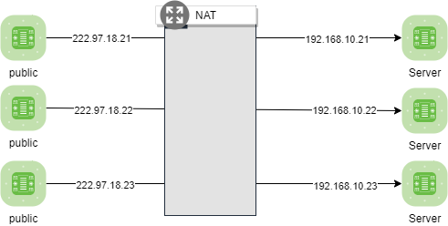
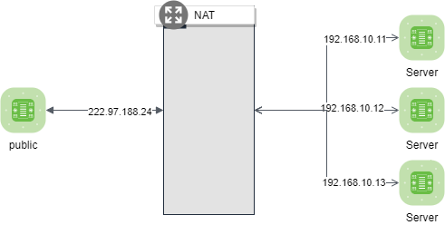

# NAT (Network Address Translation)

> NAT(Network Address Translation) 네트워크 주소를 변환하는 서비스 
> 여러 가지 이유가 있지만 사설아이피와 공인아이피를 매핑해서 사용하는 용도로 사용

## NAT 종류 

###  static NAT
- public ip 1 EA = private IP 1EA 

### Dynamic NAT
- public ip 1 EA = private IP N EA 

### PAT (Port Address Translation)
- public ip 1 EA = private IP N EA   
특정 포트를 이용하여  private IP에 추가적 매핑이 가능  
  (port forwarding/port mapping 으로 혼용해서 사용하기도 함)

