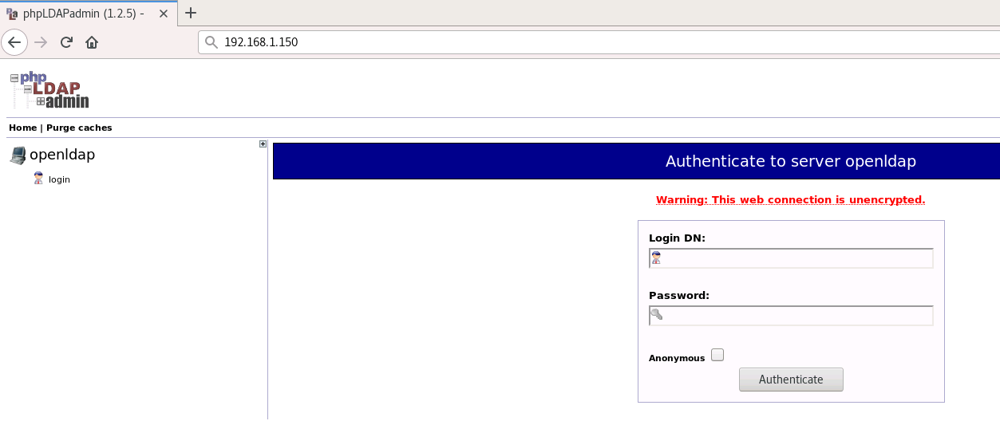
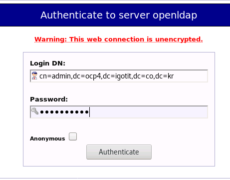
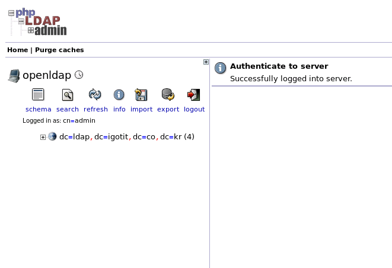
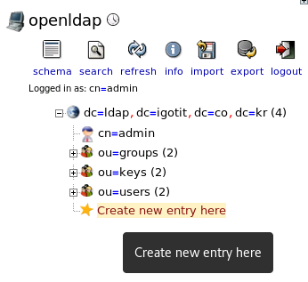
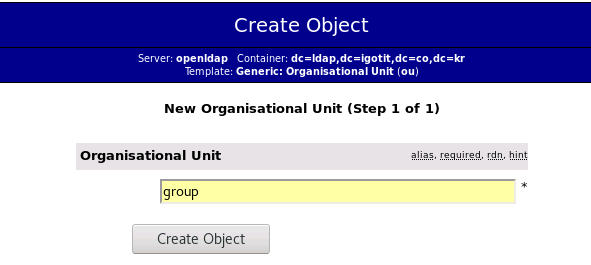
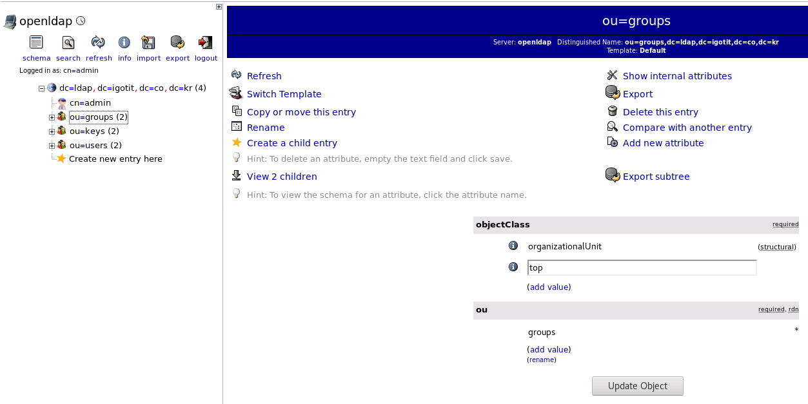
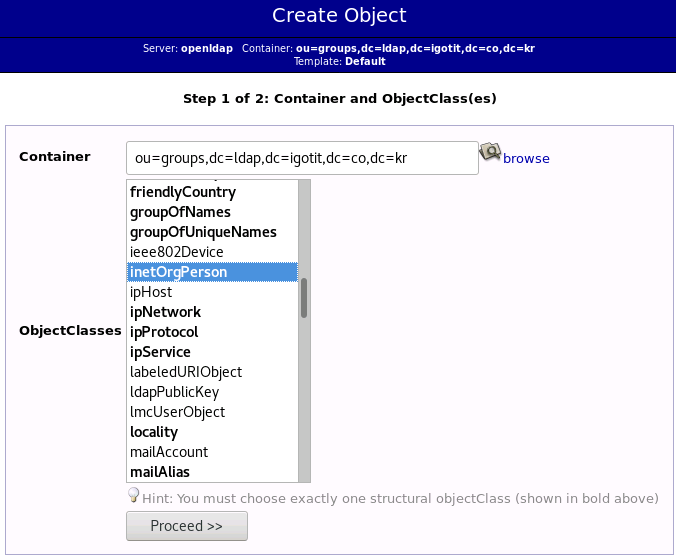
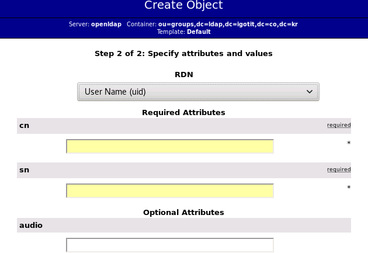

# phpldapadmin 으로 구성하기 

## 설치된 Url로 접속 
설치된 아이피가 192.168.1.150 이며 80port로 open
웹으로 서비스되는 ldap 관리 화면 


## 관리 페이지 로그인 
설치시  설정한  bindDN및 password를 이용하여 로그인 

|-|-|
|----------------------------|------------------------------------------------------------|
|{: width="300"}|{: width="300"}|

## ou 설정 

|||
|----------------------------|------------------------------------------------------------|
||좌측 메뉴의 트리 세부 항목중 "create new entry here"을 클릭 한다| 
| | 우측의 Generic: Oraganisational Unit 을 선택한다|
||사용할 ou를 생성 한다 users, groups, keys 세개의 ou를 생성 (용도에 맞게 생성) |


## user 생성 

|||
|----------------------------|------------------------------------------------------------|
||좌측 메뉴 ou중 하나 선택 <br> 선택 이후 우측 메뉴에서  Create a child entry 클릭 <br> 우측 메뉴에서 default 선택  |
||inetOrgPerson 선택 후 Proceed 클릭 |
||step2에서 rdn-> uid 선택, cn-> username, sn-> username 입력 이후 Create Object 클릭|
||각 ou에 필요한 사용자 추가|


### global config에 대한 ldif 

```
# LDIF Export for dc=ldap,dc=igotit,dc=co,dc=kr
# Server: openldap (openldap)
# Search Scope: sub
# Search Filter: (objectClass=*)
# Total Entries: 11
#
# Generated by phpLDAPadmin (http://phpldapadmin.sourceforge.net) on July 22, 2020 1:22 am
# Version: 1.2.5

version: 1

# Entry 1: dc=ldap,dc=igotit,dc=co,dc=kr
dn: dc=ldap,dc=igotit,dc=co,dc=kr
dc: ldap
o: Futuregen Inc.
objectclass: top
objectclass: dcObject
objectclass: organization

# Entry 2: cn=admin,dc=ldap,dc=igotit,dc=co,dc=kr
dn: cn=admin,dc=ldap,dc=igotit,dc=co,dc=kr
cn: admin
description: LDAP administrator
objectclass: simpleSecurityObject
objectclass: organizationalRole
userpassword: {SSHA}F3M5qpbn9FFTyFTNiajMqu93yUU8WnT1
```

### users ou에 대한 ldif

```
# LDIF Export for ou=users,dc=ldap,dc=igotit,dc=co,dc=kr
# Server: openldap (openldap)
# Search Scope: sub
# Search Filter: (objectClass=*)
# Total Entries: 3
#
# Generated by phpLDAPadmin (http://phpldapadmin.sourceforge.net) on July 22, 2020 1:21 am
# Version: 1.2.5

version: 1

# Entry 1: ou=users,dc=ldap,dc=igotit,dc=co,dc=kr
dn: ou=users,dc=ldap,dc=igotit,dc=co,dc=kr
objectclass: organizationalUnit
objectclass: top
ou: users

# Entry 2: uid=user1,ou=users,dc=ldap,dc=igotit,dc=co,dc=kr
dn: uid=user1,ou=users,dc=ldap,dc=igotit,dc=co,dc=kr
cn: user1
objectclass: inetOrgPerson
objectclass: top
sn: user1
uid: user1
userpassword: {MD5}xRW+O352K5FBkX+WMhTv3Q==

# Entry 3: uid=user2,ou=users,dc=ldap,dc=igotit,dc=co,dc=kr
dn: uid=user2,ou=users,dc=ldap,dc=igotit,dc=co,dc=kr
cn: user2
objectclass: inetOrgPerson
objectclass: top
sn: user2
uid: user2
userpassword: {MD5}xRW+O352K5FBkX+WMhTv3Q==

```


### groups ou에 대한 ldif

```
# LDIF Export for ou=groups,dc=ldap,dc=igotit,dc=co,dc=kr
# Server: openldap (openldap)
# Search Scope: sub
# Search Filter: (objectClass=*)
# Total Entries: 3
#
# Generated by phpLDAPadmin (http://phpldapadmin.sourceforge.net) on July 22, 2020 1:19 am
# Version: 1.2.5

version: 1

# Entry 1: ou=groups,dc=ldap,dc=igotit,dc=co,dc=kr
dn: ou=groups,dc=ldap,dc=igotit,dc=co,dc=kr
objectclass: organizationalUnit
objectclass: top
ou: groups

# Entry 2: uid=group1,ou=groups,dc=ldap,dc=igotit,dc=co,dc=kr
dn: uid=group1,ou=groups,dc=ldap,dc=igotit,dc=co,dc=kr
cn: group1
objectclass: inetOrgPerson
objectclass: top
sn: group1
uid: group1
userpassword: {MD5}xRW+O352K5FBkX+WMhTv3Q==

# Entry 3: uid=group2,ou=groups,dc=ldap,dc=igotit,dc=co,dc=kr
dn: uid=group2,ou=groups,dc=ldap,dc=igotit,dc=co,dc=kr
cn: group2
objectclass: inetOrgPerson
objectclass: top
sn: group2
uid: group2
userpassword: {MD5}xRW+O352K5FBkX+WMhTv3Q==
```

### keys ou에 대한 ldif
```
# LDIF Export for ou=keys,dc=ldap,dc=igotit,dc=co,dc=kr
# Server: openldap (openldap)
# Search Scope: sub
# Search Filter: (objectClass=*)
# Total Entries: 3
#
# Generated by phpLDAPadmin (http://phpldapadmin.sourceforge.net) on July 22, 2020 1:19 am
# Version: 1.2.5

version: 1

# Entry 1: ou=keys,dc=ldap,dc=igotit,dc=co,dc=kr
dn: ou=keys,dc=ldap,dc=igotit,dc=co,dc=kr
objectclass: organizationalUnit
objectclass: top
ou: keys

# Entry 2: uid=key1,ou=keys,dc=ldap,dc=igotit,dc=co,dc=kr
dn: uid=key1,ou=keys,dc=ldap,dc=igotit,dc=co,dc=kr
cn: key1
objectclass: inetOrgPerson
objectclass: top
sn: key1
uid: key1
userpassword: {MD5}xRW+O352K5FBkX+WMhTv3Q==

# Entry 3: uid=key2,ou=keys,dc=ldap,dc=igotit,dc=co,dc=kr
dn: uid=key2,ou=keys,dc=ldap,dc=igotit,dc=co,dc=kr
cn: key2
objectclass: inetOrgPerson
objectclass: top
sn: key2
uid: key2
userpassword: {MD5}xRW+O352K5FBkX+WMhTv3Q==
```
