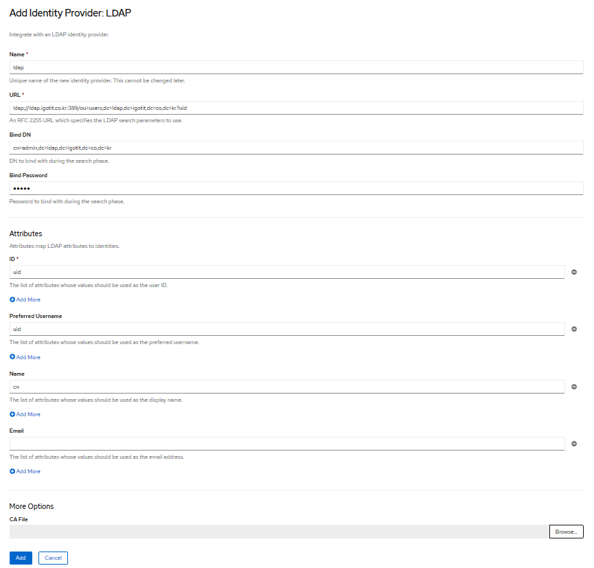

## ldap identity providerfor openshift


### 1. webconsole 
Cluster setting (left) -> Global Configuration (sub-top) -> Oauth -> add (bottom)


name: ldapidp <br>
url: "ldap://ldap.igotit.co.kr:389/ou=users,dc=ldap,dc=igotit,dc=co,dc=kr?uid" <br>
bindDN: 'cn=admin,dc=ldap,dc=igotit,dc=co,dc=kr' <br>
passwd: ldap의 cn=admin,dc=ldap,dc=igotit,dc=co,dc=kr 패스워드  <br>
ID : uid  (사용자 설정시 사용한 rdn 필드)

### 2. yaml file

```
## ldap 연결 패스워드 secret 설정 
$ oc create secret generic ldap-secret --from-literal=bindPassword=<secret> -n openshift-config

## ldap 연결시 사용할 ca configmap 작성 
$ oc create configmap ca-config-map --from-file=ca.crt=/path/to/ca -n openshift-config


## oauth-ldap.yaml
## insecure false -> true (보안연결을 사용하지 않는다면)

apiVersion: config.openshift.io/v1
kind: OAuth
metadata:
  name: cluster
spec:
  identityProviders:
  - name: ldapidp 
    mappingMethod: claim 
    type: LDAP
    ldap:
      attributes:
        id: 
        - uid
        email: 
        - mail
        name: 
        - cn
        preferredUsername: 
        - uid
      bindDN: 'cn=admin,dc=ldap,dc=igotit,dc=co,dc=kr' 
      bindPassword: 
        name: ldap-secret
      ca: 
        name: ca-config-map
      insecure: false 
      url: "ldap://ldap.igotit.co.kr:389/ou=users,dc=ldap,dc=igotit,dc=co,dc=kr?uid?sub"

``` 
