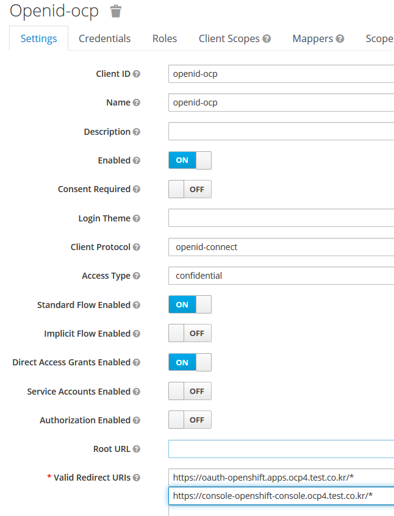

# keycloak 설정 

## realm 설정 
keycloak 관리페이지 접속 이후  
add realm을 클릭하여 openid를 이용할 realm을 생성 

**issuer주소를 복사** 
OpenID Endpoint Configuration을 클릭하면 issuer주소를 확인 가능하다

## client 설정 
### client 생성
keycloak 관리페이지 접속 이후  
create을 클릭 
 

 
 
### client 설정 
keycloak 관리페이지 접속 이후  
openid-ocp 클릭 

###Credential값을 clipboard에 복사 
**Client Authenticator : Client ID and Secret**

