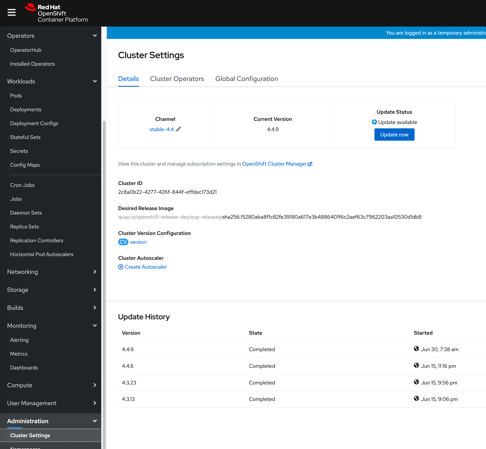
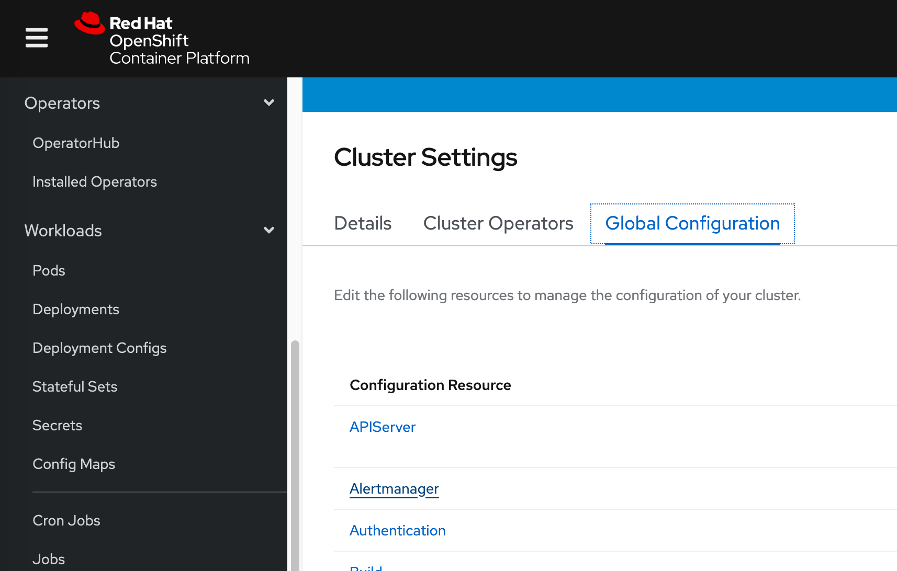
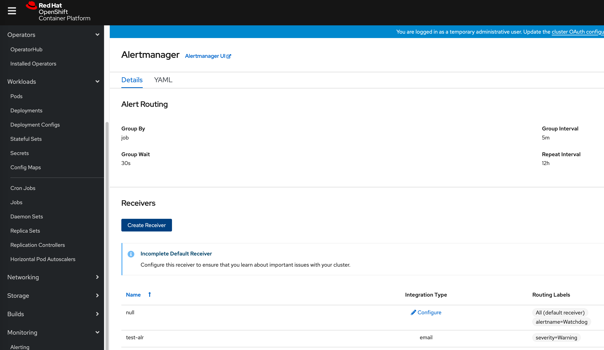
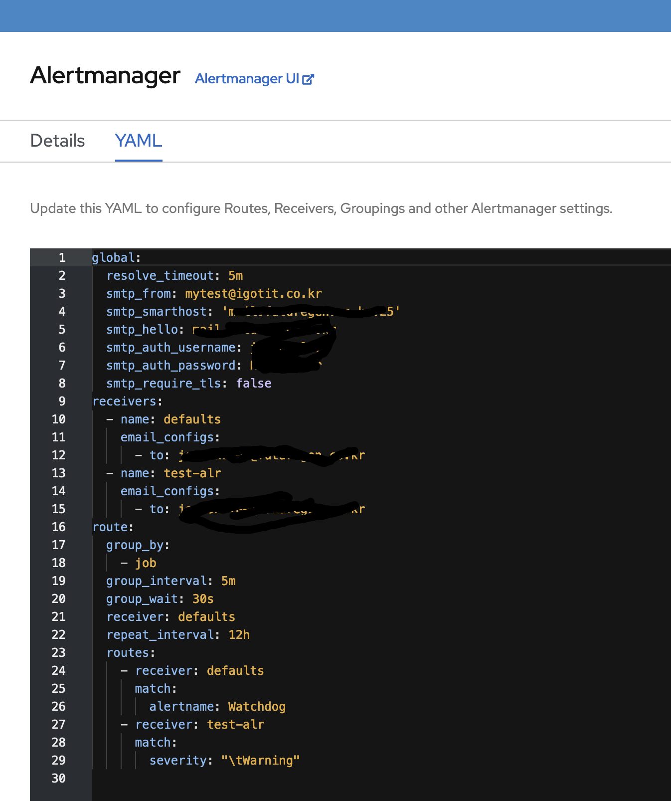

# Alertmanager Configuration

## email 을 이용한 Alertmanager

먼저 웹 화면을 이용하여 접근 하여 찾아가자 

Administratration -> Cluster Settings 로 이동하자



Global Configurations를 클릭하자



Alertmanager를 클릭하자



YAML 을 클릭하여 수정하자



```
global:
  resolve_timeout: 5m
  smtp_from: <보내는 곳의 식별 메일주소>
  smtp_smarthost: '<smtp 주소>:25'
  smtp_hello: < hello 이름 보통 호스트 네임 >
  smtp_auth_username: <사용자아이디>
  smtp_auth_password: <사용자 페스워드>
  smtp_require_tls: false
receivers:
  - name: defaults
    email_configs:
      - to: <알람을 받는 메일주소>
  - name: test-alr
    email_configs:
      - to: <알람을 받는 메일주소>
route:
  group_by:
    - job
  group_interval: 5m
  group_wait: 30s
  receiver: defaults
  repeat_interval: 12h
  routes:
    - receiver: defaults
      match:
        alertname: Watchdog
    - receiver: test-alr
      match:
        severity: "\tWarning"
```

