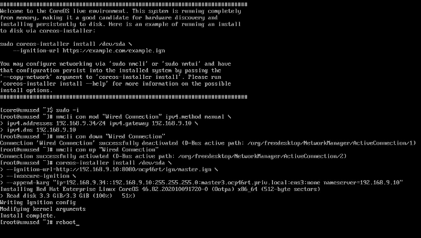

# openshift 4.6 install  (UPI bearMetal) 

---

## requerment

### H/W
|Machine|Operating System|vCPU|Virtual RAM|Storage|amount|
|:---:|:---:|:---:|:---:|:---:|:---:|
|Bootstrap|RHCOS|4|16 GB|120 GB|1|
|Control plane|RHCOS|4|16 GB|120 GB|3|
|Compute|RHCOS or RHEL 7.6|2|8 GB|120 GB|2|

### DNS
|Port|Back-end machines (pool members)|Internal|External|Description|
|:---:|:---:|:---:|:---:|:---:|
|6443/tcp|bootstrap & control palne| ○ | △ |Kubernetes API server|
|22623/tcp|bootstrap & control palne| ○ |  |Kubernetes API server|
|80/tcp|A node that can be routed among nodes| ○ | ○ |ingress service|
|443/tcp|A node that can be routed among nodes| ○ | ○ |ingress service|

### firewall policy

**machine to machine** 
|Protocol|Port|Description|
|:---:|:---:|:---:|
|ICMP|N/A|Network reachability tests|
|TCP|9000-9999|Host level services, including the node exporter on ports 9100-9101 and the Cluster Version Operator on port 9099.|
|TCP|10250-10259|The default ports that Kubernetes reserves|
|TCP|10256|openshift-sdn|
|UDP|4789|VXLAN and Geneve|
|UDP|6081|VXLAN and Geneve|
|UDP|9000-9999|Host level services, including the node exporter on ports 9100-9101.|
|TCP/UDP|30000-32767|Kubernetes NodePort|

**Control plane to machine**
|Protocol|Port|Description|
|:---:|:---:|:---:|
|TCP|2379-2380|etcd server, peer, and metrics ports|
|TCP|6443|Kubernetes API|

**DNS Recode**

|Recode|name|target|etc|
|:---:|:---:|:---:|-----|
|A|api|lb|k8s api|
|A|api-int|lb|k8s api|
|A|apps|lb|route|
|A|bootstrap|IP|server|
|A|master|IP|server|
|A|worker|IP|server|
|A|etcd-<index>|ip|master|
|SRV|_etcd-server-ssl._tcp|etcd-<index>|86400 IN    SRV 0        10|

## bastion 구성 

### Subscription 등록(전체 서버. disconnect 환경인 경우 외부 연결되는 서버에만)

	subscription-manager register --username=***** --password=******
	subscription-manager refresh
	subscription-manager list --available --matches '*OpenShift*'
	subscription-manager attach --pool=8a85f99c707807c801709f913ded7153
	subscription-manager repos     --enable="rhel-7-server-rpms"     \
		                           --enable="rhel-7-server-extras-rpms"     \
		                           --enable="rhel-7-server-ose-4.6-rpms"     \
		                           --enable="rhel-7-server-ansible-2.9-rpms"

### repo server 구성 (테스트시 bastion또는 gate서버에 설정)  

	sudo yum -y install yum-utils createrepo docker git vsftpd

### repo 동기화 및 구성

	for repo in rhel-7-server-rpms rhel-7-server-extras-rpms rhel-7-server-ansible-2.9-rpms rhel-7-server-ose-4.6-rpms
	do
  		reposync --gpgcheck -lm --repoid=${repo} --download_path=/var/ftp/pub/repos
  		createrepo -v /var/ftp/pub/repos/${repo} -o /var/ftp/pub/repos${repo}
	done

### ftp 구동 

	systemctl enable vsftpd
	systemctl start vsftpd

### 설치에 필요한 파일 다운

	wget https://mirror.openshift.com/pub/openshift-v4/clients/ocp/latest/openshift-install-linux.tar.gz
	wget https://mirror.openshift.com/pub/openshift-v4/clients/ocp/latest/openshift-client-linux.tar.gz
	wget https://mirror.openshift.com/pub/openshift-v4/dependencies/rhcos/latest/latest/rhcos-installer.x86_64.iso
	wget https://mirror.openshift.com/pub/openshift-v4/dependencies/rhcos/latest/latest/rhcos-metal.x86_64.raw.gz
	
	tar zxvfp openshift-install-linux.tar.gz
	rm -f README.txt 
	mv openshift-install /usr/local/bin/
	chown core.core /usr/local/bin/openshift-install
	chmod 750 /usr/local/bin/openshift-install
	
	tar zxvfp openshift-client-linux.tar.gz
	rm -f README.txt
	mv kubectl /usr/local/bin/
	mv oc /usr/local/bin/
	chown core.core /usr/local/bin/kubectl
	chown core.core /usr/local/bin/oc
	chmod 750 /usr/local/bin/kubectl
	chmod 750 /usr/local/bin/oc

### pull secrets 구성 

**pull secrets down**

	https://cloud.redhat.com/openshift/install/metal/user-provisioned pull-secret download
	cd /opt/ocp4.3/pull
	cat ./pull-secret.text | jq .  > pull-secret.json

**mirror registry 구성시 추가 부분**

	mirror-registry 등록 (online 환경에서는 옵션)
	
	echo -n 'admin:admin' | base64 -w0  # admin:admin ( mirror registry 접속 계정 )
	**YWRtaW46YWRtaW4=**
	
	vi pull-secret.json  (아래 부부분 추가)
	    	}**,
	    	"registry.ocp4-1.fu.te" {
	  		"auth": "YWRtaW46YWRtaW4=",
	  		"email": "jaesuk.lee@futuregen.co.kr"
			}**
  		}
	}

**podman login을 위한 config 설정**

	# bastion과 mirror registry 가 구동되는 서버에 설정 
	mkdir /home/core/.docker
	cp -Rp path/to/pull-secret.json /home/core/.docker/config.json


**ssh key 생성**
	
	ssh-keygen -t rsa -b 4096 -N ''
	
	eval "$(ssh-agent -s)"
		Agent pid 6020
	
	ssh-add
		Identity added: /home/core/.ssh/id_rsa (/home/core/.ssh/id_rsa)


## 설지 사전 작업 

### 인스톨 컨피그 생성 

	Path : /home/core/ocp46/intall/
	
	filename install-config.yaml


 	
	apiVersion: v1
	baseDomain: example.com 
	compute:
	- hyperthreading: Enabled   
  		name: worker
  		replicas: 0 
	controlPlane:
	  hyperthreading: Enabled   
	  name: master 
	  replicas: 3 
	metadata:
	  name: test 
	networking:
  		clusterNetwork:
  		- cidr: 10.128.0.0/14 
	    hostPrefix: 23 
	  networkType: OpenShiftSDN
	  serviceNetwork: 
	  - 172.30.0.0/16
	platform:
	    none: {} 
	fips: false 
	pullSecret: '{"auths": ...}' 
	sshKey: 'ssh-ed25519 AAAA...' 

### ignition 파일 생성 

	openshift-install create manifests --dir=/home/core/ocp46/install/
	
	**# cluster-scheduler-02-config 수정  control-plane에 사용자 파드 배포되지않게** 
	vi /home/core/ocp46/install/manifests/cluster-scheduler-02-config.yml
	...
	spec:
  	mastersSchedulable: false
  	policy:
	...


	openshift-install create ignition-configs --dir=/home/core/ocp46/install/
	
	**# ignition 파일 복사**
	sudo cp -Rp  /home/core/ocp46/install/*.ign /var/ftp/pub/ign/


### 인증 파일 연결 

	export KUBECONFIG=/home/core/ocp46/install/auth/kubeconfig

 

### [ignition 파일 Customizing](./INFRA/common/ignition-file-Customizing)


## Clutster 설치

### coreos 설치 방법 

```
coreos live CD로 부팅 

coreos-installer를 이용한 설치 
```


###  설치 노드 정리 

```
bootstrap 1번째 설치 
master01  2번째 설치
master02  2번째 설치
master03  2번째 설치
worker01  3번째 설치
worker02  3번째 설치
위의 순서로 설치 
```

```
bootstrap 설치 옵선

sudo nmcli con mod "Wired Connection" ipv4.method manual  ipv4.addresses 192.168.6.210/24 ipv4.gateway 192.168.6.1 ipv4.dns 192.168.6.1
sudo nmcli con down "Wired Connection"
sudo nmcli con up   "Wired Connection"
sudo nmcli general hostname bootstrap.example.com
sudo coreos-installer install /dev/sda \
  --ignition-url=http://192.168.6.201/pub/ign/bootstrap.ign \
  --insecure-ignition \
  --append-karg "ip=192.168.6.210::192.168.6.1:255.255.255.0:bootstrap.example.com:ens192:none nameserver=192.168.6.1" 
```

```
master 설치 옵선

sudo nmcli con mod "Wired Connection" ipv4.method manual  ipv4.addresses 192.168.6.211/24 ipv4.gateway 192.168.6.1 ipv4.dns 192.168.6.1
sudo nmcli con down "Wired Connection"
sudo nmcli con up   "Wired Connection"
sudo nmcli general hostname master01.example.com
sudo coreos-installer install /dev/sda \
  --ignition-url=http://192.168.6.201/pub/ign/master.ign \
  --insecure-ignition \
  --append-karg "ip=192.168.6.211::192.168.6.1:255.255.255.0:master01.example.com:ens192:none nameserver=192.168.6.1" 

sudo nmcli con mod "Wired Connection" ipv4.method manual  ipv4.addresses 192.168.6.212/24 ipv4.gateway 192.168.6.1 ipv4.dns 192.168.6.1
sudo nmcli con down "Wired Connection"
sudo nmcli con up   "Wired Connection"
sudo nmcli general hostname master02.example.com
sudo coreos-installer install /dev/sda \
  --ignition-url=http://192.168.6.201/pub/ign/master.ign \
  --insecure-ignition \
  --append-karg "ip=192.168.6.212::192.168.6.1:255.255.255.0:master02.example.com:ens192:none nameserver=192.168.6.1" 
 
sudo nmcli con mod "Wired Connection" ipv4.method manual  ipv4.addresses 192.168.6.213/24 ipv4.gateway 192.168.6.1 ipv4.dns 192.168.6.1
sudo nmcli con down "Wired Connection"
sudo nmcli con up   "Wired Connection"
sudo nmcli general hostname master03.example.com
sudo coreos-installer install /dev/sda \
  --ignition-url=http://192.168.6.201/pub/ign/master.ign \
  --insecure-ignition \
  --append-karg "ip=192.168.6.213::192.168.6.1:255.255.255.0:master03.example.com:ens192:none nameserver=192.168.6.1" 
```

```
worker 설치 옵선

sudo nmcli con mod "Wired Connection" ipv4.method manual  ipv4.addresses 192.168.6.221/24 ipv4.gateway 192.168.6.1 ipv4.dns 192.168.6.1
sudo nmcli con down "Wired Connection"
sudo nmcli con up   "Wired Connection"
sudo nmcli general hostname worker01.example.com
sudo coreos-installer install /dev/sda \
  --ignition-url=http://192.168.6.201/pub/ign/master.ign \
  --insecure-ignition \
  --append-karg "ip=192.168.6.221::192.168.6.1:255.255.255.0:worker01.example.com:ens192:none nameserver=192.168.6.1" 

sudo nmcli con mod "Wired Connection" ipv4.method manual  ipv4.addresses 192.168.6.222/24 ipv4.gateway 192.168.6.1 ipv4.dns 192.168.6.1
sudo nmcli con down "Wired Connection"
sudo nmcli con up   "Wired Connection"
sudo nmcli general hostname worker02.example.com
sudo coreos-installer install /dev/sda \
  --ignition-url=http://192.168.6.201/pub/ign/master.ign \
  --insecure-ignition \
  --append-karg "ip=192.168.6.222::192.168.6.1:255.255.255.0:worker02.example.com:ens192:none nameserver=192.168.6.1" 
```




### Wait for completing the bootstrap process after run Bootstrap and Master nodes.

```
core@bastion ~$ openshift-install wait-for bootstrap-complete \
                 --dir install_dir --log-level debug
DEBUG OpenShift Installer 4.6.4                    
DEBUG Built from commit ebdbda57fc18d3b73e69f0f2cc499ddfca7e6593 
INFO Waiting up to 20m0s for the Kubernetes API at https://api.ocp46rt.example.com:6443... 
:
INFO API v1.19.0+d59ce34 up                       
INFO Waiting up to 30m0s for bootstrapping to complete... 
:
INFO It is now safe to remove the bootstrap resources 
DEBUG Time elapsed per stage:                      
DEBUG Bootstrap Complete: 7m58s                    
DEBUG                API: 2m52s                    
INFO Time elapsed: 7m58
```


###  After the bootstrap process, you can log in the OCP cluster and add worker nodes

 ``` 
core@bastion ~$ export KUBECONFIG=/home/core/ocp46/install/auth/kubeconfig

core@bastion ~$ oc get node
NAME                            STATUS   ROLES    AGE     VERSION
master01.test.fu.igotit.co.kr   Ready    master   4h1m    v1.19.0+9f84db3
master02.test.fu.igotit.co.kr   Ready    master   4h1m    v1.19.0+9f84db3
master03.test.fu.igotit.co.kr   Ready    master   4h1m    v1.19.0+9f84db3
worker01.test.fu.igotit.co.kr   Ready    worker   3h45m   v1.19.0+9f84db3
worker02.test.fu.igotit.co.kr   Ready    worker   3h45m   v1.19.0+9f84db3
 ```


```


user2@bastion ~$ oc get csr | grep Pending
csr-8zz9h   5m31s   kubernetes.io/kube-apiserver-client-kubelet   system:serviceaccount:openshift-machine-config-operator:node-bootstrapper   Pending
csr-ltb9x   8m23s   kubernetes.io/kube-apiserver-client-kubelet   system:serviceaccount:openshift-machine-config-operator:node-bootstrapper   Pending
csr-nh6v6   75s     kubernetes.io/kube-apiserver-client-kubelet   system:serviceaccount:openshift-machine-config-operator:node-bootstrapper   Pending

user2@bastion ~$ oc get csr -o name | xargs oc adm certificate approve
:

core@bastion ~$ oc get node
NAME                         STATUS     ROLES    AGE    VERSION
master01.test.fu.igotit.co.kr   Ready    master   166m    v1.19.0+9f84db3
master02.test.fu.igotit.co.kr   Ready    master   168m      v1.19.0+9f84db3
master03.test.fu.igotit.co.kr   Ready    master   61m    v1.19.0+9f84db3
worker01.test.fu.igotit.co.kr   NotReady   worker   104s   v1.19.0+9f84db3
worker02.test.fu.igotit.co.kr   NotReady   worker   0s     v1.19.0+9f84db3

core@bastion ~$ oc get csr | grep Pending
csr-4c8fp   2m26s   kubernetes.io/kubelet-serving                 system:node:worker3.ocp46rt.priv.local                                      Pending
csr-dvpdl   2m25s   kubernetes.io/kubelet-serving                 system:node:worker1.ocp46rt.priv.local                                      Pending

core@bastion ~$ oc get csr -o name | xargs oc adm certificate approve
:

core@bastion ~$ oc get node
NAME                         STATUS   ROLES    AGE     VERSION
master01.test.fu.igotit.co.kr   Ready    master   4h1m    v1.19.0+9f84db3
master02.test.fu.igotit.co.kr   Ready    master   4h1m    v1.19.0+9f84db3
master03.test.fu.igotit.co.kr   Ready    master   4h1m    v1.19.0+9f84db3
worker01.test.fu.igotit.co.kr   Ready    worker   3h45m   v1.19.0+9f84db3
worker02.test.fu.igotit.co.kr   Ready    worker   3h45m   v1.19.0+9f84db3

```


### cluster operator is **AVAILABLE: True**.

```
[core@bastion ~]$ oc get co
NAME                                       VERSION   AVAILABLE   PROGRESSING   DEGRADED   SINCE
authentication                             4.6.4     True        False         False      3h45m
cloud-credential                           4.6.4     True        False         False      4h31m
cluster-autoscaler                         4.6.4     True        False         False      4h12m
config-operator                            4.6.4     True        False         False      4h13m
console                                    4.6.4     True        False         False      3h55m
csi-snapshot-controller                    4.6.4     True        False         False      4h13m
dns                                        4.6.4     True        False         False      4h10m
etcd                                       4.6.4     True        False         False      4h8m
image-registry                             4.6.4     True        False         False      4h5m
ingress                                    4.6.4     True        False         False      3h58m
insights                                   4.6.4     True        False         False      4h13m
kube-apiserver                             4.6.4     True        False         False      4h8m
kube-controller-manager                    4.6.4     True        False         False      4h8m
kube-scheduler                             4.6.4     True        False         False      4h7m
kube-storage-version-migrator              4.6.4     True        False         False      3h58m
machine-api                                4.6.4     True        False         False      4h12m
machine-approver                           4.6.4     True        False         False      4h13m
machine-config                             4.6.4     True        False         False      4h9m
marketplace                                4.6.4     True        False         False      4h11m
monitoring                                 4.6.4     True        False         False      3h58m
network                                    4.6.4     True        False         False      4h14m
node-tuning                                4.6.4     True        False         False      4h13m
openshift-apiserver                        4.6.4     True        False         False      4h5m
openshift-controller-manager               4.6.4     True        False         False      4h7m
openshift-samples                          4.6.4     True        False         False      4h4m
operator-lifecycle-manager                 4.6.4     True        False         False      4h12m
operator-lifecycle-manager-catalog         4.6.4     True        False         False      4h12m
operator-lifecycle-manager-packageserver   4.6.4     True        False         False      4h5m
service-ca                                 4.6.4     True        False         False      4h13m
storage                                    4.6.4     True        False         False      4h13m
```

