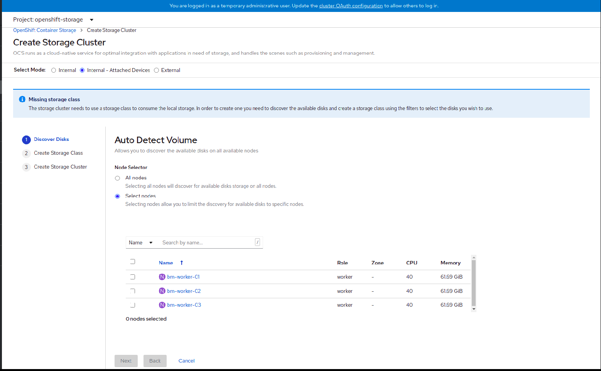

# OpenShift Container Storage

## 사전 확인 및 준비 

### 필요한 오픈 시프트 플랫폼 버전

- OpenShift Container Platform 4.5 (one version behind)

- OpenShift Container Platform 4.6 (same version)

- OpenShift Container Platform 4.7 (one version ahead)

  

### 사용 가능한 플랫폼

**[Support]**

```
Amazon EC2
Bare Metal
VMware  vSphere Recommended version: vSphere 6.7, Update 2
```

**[Technology Preview]**

```
	Google Cloud 
	Red Hat Virtualization Platform 
	Red Hat OpenStack Platform 
	IBM Power Systems 
	IBM Z and LinuxONE 
```


### 필요한 스펙

**[일번적인 구성]**

| **Deployment Mode** | **Base services**                                          | **Additional device Set**                                  |
| ------------------- | ---------------------------------------------------------- | ---------------------------------------------------------- |
| Internal            | 30 CPU (logical) <br />72GB memory <br />3 storage devices | 6 CPU (logical) <br />15 GB memory <br />3 storage devices |
| External            | 4 CPU (logical) <br />16 GB memory                         |                                                            |

**[최소 사양  구성]**

| **Deployment Mode** | **Base services**                                          |
| ------------------- | ---------------------------------------------------------- |
| Internal            | 24 CPU (logical) <br />72GB memory <br />3 storage devices |

**[컴팩트 구성 ]**

| **Deployment Mode** | **Base services**                                          | **Additional device Set**                                  |
| ------------------- | ---------------------------------------------------------- | ---------------------------------------------------------- |
| Internal            | 12 CPU (logical) <br />48GB memory <br />3 storage devices | 6 CPU (logical) <br />15 GB memory <br />3 storage devices |

> **CPU unit**
>
> 이 섹션에서 1 개의 CPU 단위는 1 개의 CPU 단위라는 Kubernetes 개념에 매핑됩니다.
>
> - CPU 1 개는 하이퍼 스레드되지 않은 CPU의 경우 1 개 코어에 해당합니다.
> - 2 개의 CPU는 하이퍼 스레드 CPU의 경우 1 개의 코어에 해당합니다.
> - OpenShift Container Storage 코어 기반 구독은 항상 쌍으로 제공됩니다 (코어 2 개).
> - 

### Pod 배치 규칙 

- 노드는 `cluster.ocs.openshift.io/openshift-storage`키로 레이블이 지정됩니다.
- 노드가없는 경우 의사 장애 도메인으로 정렬됩니다.
- 고 가용성이 필요한 구성 요소는 장애 도메인에 분산되어 있습니다.
- 각 장애 도메인에서 스토리지 장치에 액세스 할 수 있어야합니다.

### 용량 계획 

**Table 7.4. Example initial configurations with 3 nodes**

| **Storage Device size** | **Storage Devices per node** | Total capacity | Usable storage capacity |
| ----------------------- | ---------------------------- | -------------- | ----------------------- |
| 0.5TiB                  | 1                            | 1.5TiB         | 0.5TiB                  |
| 2TiB                    | 1                            | 6TiB           | 2TiB                    |
| 4TiB                    | 1                            | 12TiB          | 4TiB                    |

**Table 7.5. Example of expanded configurations with 30 nodes (N)**

| **Storage Device size**(D) | **Storage Devices per node**(M) | Total capacity(D\*M\*N) | Usable storage capacity(D\*M\*N/3) |
| -------------------------- | ------------------------------- | ----------------------- | ---------------------------------- |
| 0.5TiB                     | 3                               | 45TiB                   | 15TiB                              |
| 2TiB                       | 6                               | 360TiB                  | 120TiB                             |
| 4TiB                       | 9                               | 1080TiB                 | 360TiB                             |


## 설치 방법 

### RHEL node 

```
# subscription-manager repos --enable=rhel-7-server-rpms
# subscription-manager repos --enable=rhel-7-server-extras-rpms
# yum install -y policycoreutils container-selinux
# setsebool -P container_use_cephfs on
```

### storage cluster node  설정 

```
$ oc annotate namespace openshift-storage openshift.io/node-selector=
```

### openshift container storage operater install

1. Operators → OperatorHub

2. OpenShift Container Storage 를 찾아 들어 간다.

3. 해당 페이지에서 install 

   채널을 안정된 4.6 설치 모드

    클러스터의 특정 네임 스페이스로 업데이트 

   operator  권장 네임 스페이스 openshift-storage로 네임 스페이스를 설치

    Namespace openshift-storage가없는 경우 operator 설치시 생성됨 

4. Enable operator recommended cluster monitoring on this namespace 항목 check

5. Automatic 으로 선택 

   

6. Install 

### local storage operator install

1. Operators → OperatorHub

2. Local Storage Operator 를 찾아 들어 간다.

3. 해당 페이지에서 install 

   채널을 안정된 4.6 설치 모드

    클러스터의 특정 네임 스페이스로 업데이트 

   operator  권장 네임 스페이스 Local Storage로 네임 스페이스를 설치

   Automatic 으로 선택 

​    

4. Install 

### local storage operator config

1. Local Volume Sets 설정 

2. Local Volume Discoveries 설정

   > 사용힐 노드를 선택하여 사용 

### openshift container storage operater config

1. **Operators → Installed Operators** 

   Openshift-storagge project. 선택 

   

2. **OpenShift Container Storage**. click

   

3. **Create Instance** click

   

4. **Internal-Attached devices**  select

   Local storage 설정을 하지 않았다면 여기서 진행 

   

   **Discover disks**

   

   필요에 따라 all node , select node를 선택한다.

   select node 선택시 필요 node. 선책 

   

   **Create Storage Class**

   

    1) **Volume Set Name** 입력 

    2) **Storage Class Name** 기본으로 **Volume Set Name**과 동일 하다.

    3) **Filter Disk** 필요한 node 선택 

   ​    구성에 따라 all node , select node를 선택한다.

    4) **Disk Type** 기본은 SSD/NVMe 이며 사용디스크에 따라  HDD 선택 가능

    5) Next 

​      **Create Storage Cluster**       

​      1) storage cluster 를 선택한다

​      2) Create 클릭 


## 설치 후 확인 사항

**Storage class 확인**

```
[core@bastion monitering]$ oc get sc
NAME                          PROVISIONER                             RECLAIMPOLICY   VOLUMEBINDINGMODE      ALLOWVOLUMEEXPANSION   AGE
ocs-storagecluster-ceph-rbd   openshift-storage.rbd.csi.ceph.com      Delete          Immediate              true                   6h49m
ocs-storagecluster-ceph-rgw   openshift-storage.ceph.rook.io/bucket   Delete          Immediate              false                  6h49m
ocs-storagecluster-cephfs     openshift-storage.cephfs.csi.ceph.com   Delete          Immediate              true                   6h49m
openshift-storage.noobaa.io   openshift-storage.noobaa.io/obc         Delete          Immediate              false                  6h44m
osc-local-sc                  kubernetes.io/no-provisioner            Delete          WaitForFirstConsumer   false                  7h49m

```

ocs-storagecluster-ceph-rbd  : block device  용  storage class

ocs-storagecluster-ceph-rgw : block device  용  storage class

ocs-storagecluster-cephfs : shared filesystem volume 용  storage class


**Pv 예제**

```
[core@bastion monitering]$ oc get pv
NAME                                       CAPACITY   ACCESS MODES   RECLAIM POLICY   STATUS   CLAIM                                                                            STORAGECLASS                  REASON   AGE
image-registry-storage                     100Gi      RWX            Retain           Bound    openshift-image-registry/image-registry-storage                                                                         24h
local-pv-726d4466                          1Ti        RWO            Delete           Bound    openshift-storage/ocs-deviceset-osc-local-sc-2-data-0-pfprm                      osc-local-sc                           7h1m
local-pv-a6c24aed                          1Ti        RWO            Delete           Bound    openshift-storage/ocs-deviceset-osc-local-sc-1-data-0-qchz7                      osc-local-sc                           7h1m
local-pv-b1c79083                          1Ti        RWO            Delete           Bound    openshift-storage/ocs-deviceset-osc-local-sc-0-data-0-djdv2                      osc-local-sc                           7h1m
pvc-47b361d8-3f4e-44ee-b82f-34c4bde62c0e   50Gi       RWO            Delete           Bound    openshift-storage/db-noobaa-db-0                                                 ocs-storagecluster-ceph-rbd            6h55m
pvc-97bf5e4a-0d1d-4df7-afb3-0f94ce4fb802   20Gi       RWO            Delete           Bound    openshift-storage/alertmanager-main-db-alertmanager-main-2-noobaa-pvc-3590408a   ocs-storagecluster-ceph-rbd            5h29m
pvc-99f03522-9b03-4187-9fb3-37c4e48d47ea   100Gi      RWO            Delete           Bound    openshift-logging/elasticsearch-elasticsearch-cdm-wpyscq6o-1                     ocs-storagecluster-ceph-rbd            3h51m
pvc-9b1fee7f-3dd6-4912-b8e0-4eba06222863   100Gi      RWO            Delete           Bound    openshift-logging/elasticsearch-elasticsearch-cdm-wpyscq6o-2                     ocs-storagecluster-ceph-rbd            3h51m
pvc-d3631814-75dd-470b-9742-6cf4a788315f   20Gi       RWO            Delete           Bound    openshift-storage/alertmanager-main-db-alertmanager-main-1-noobaa-pvc-aa6be5df   ocs-storagecluster-ceph-rbd            5h29m
```


**PVC 예제**

```
[core@bastion monitering]$ oc get pvc -A
NAMESPACE                  NAME                                                           STATUS   VOLUME                                     CAPACITY   ACCESS MODES   STORAGECLASS                  AGE
openshift-image-registry   image-registry-storage                                         Bound    image-registry-storage                     100Gi      RWX                                          24h
openshift-logging          elasticsearch-elasticsearch-cdm-wpyscq6o-1                     Bound    pvc-99f03522-9b03-4187-9fb3-37c4e48d47ea   100Gi      RWO            ocs-storagecluster-ceph-rbd   3h59m
openshift-logging          elasticsearch-elasticsearch-cdm-wpyscq6o-2                     Bound    pvc-9b1fee7f-3dd6-4912-b8e0-4eba06222863   100Gi      RWO            ocs-storagecluster-ceph-rbd   3h59m
openshift-storage          alertmanager-main-db-alertmanager-main-1-noobaa-pvc-aa6be5df   Bound    pvc-d3631814-75dd-470b-9742-6cf4a788315f   20Gi       RWO            ocs-storagecluster-ceph-rbd   5h37m
openshift-storage          alertmanager-main-db-alertmanager-main-2-noobaa-pvc-3590408a   Bound    pvc-97bf5e4a-0d1d-4df7-afb3-0f94ce4fb802   20Gi       RWO            ocs-storagecluster-ceph-rbd   5h37m
openshift-storage          db-noobaa-db-0                                                 Bound    pvc-47b361d8-3f4e-44ee-b82f-34c4bde62c0e   50Gi       RWO            ocs-storagecluster-ceph-rbd   7h4m
openshift-storage          ocs-deviceset-osc-local-sc-0-data-0-djdv2                      Bound    local-pv-b1c79083                          1Ti        RWO            osc-local-sc                  7h4m
openshift-storage          ocs-deviceset-osc-local-sc-1-data-0-qchz7                      Bound    local-pv-a6c24aed                          1Ti        RWO            osc-local-sc                  7h4m
openshift-storage          ocs-deviceset-osc-local-sc-2-data-0-pfprm                      Bound    local-pv-726d4466                          1Ti        RWO            osc-local-sc                  7h4m
```

